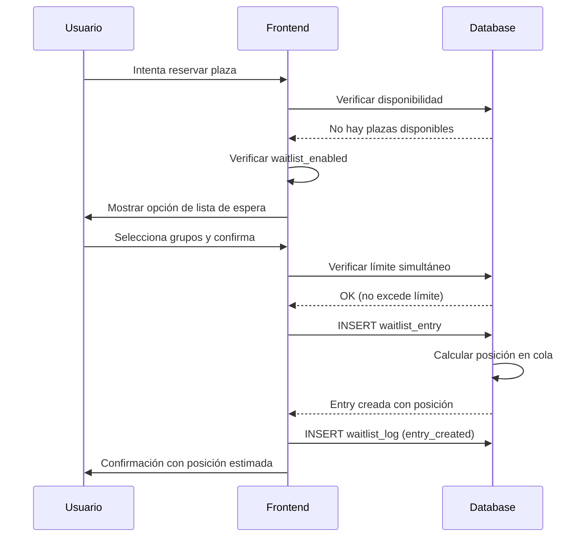
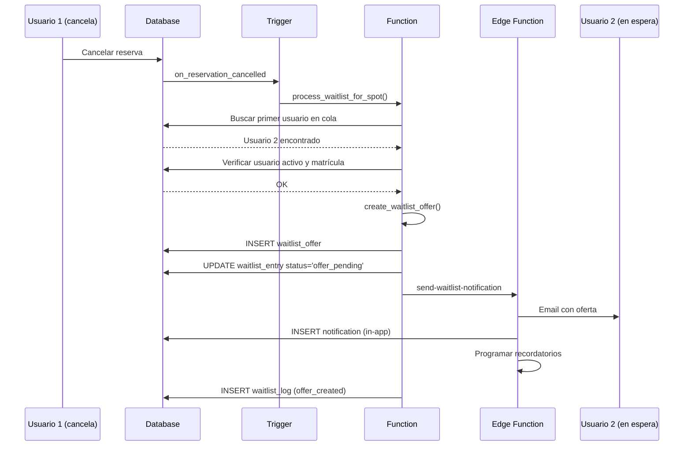
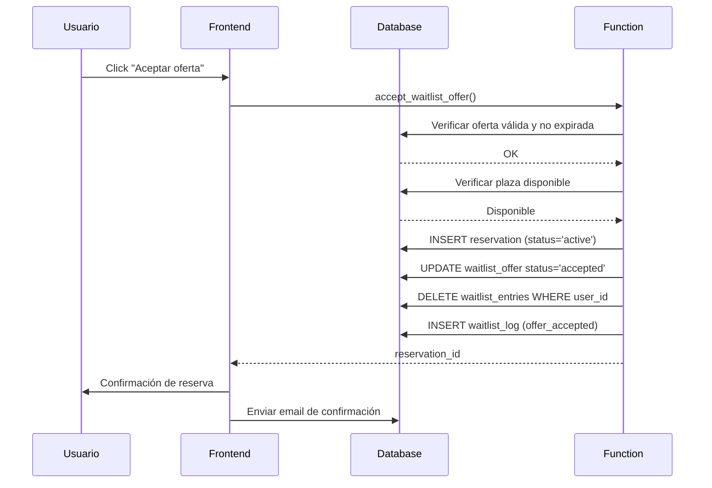
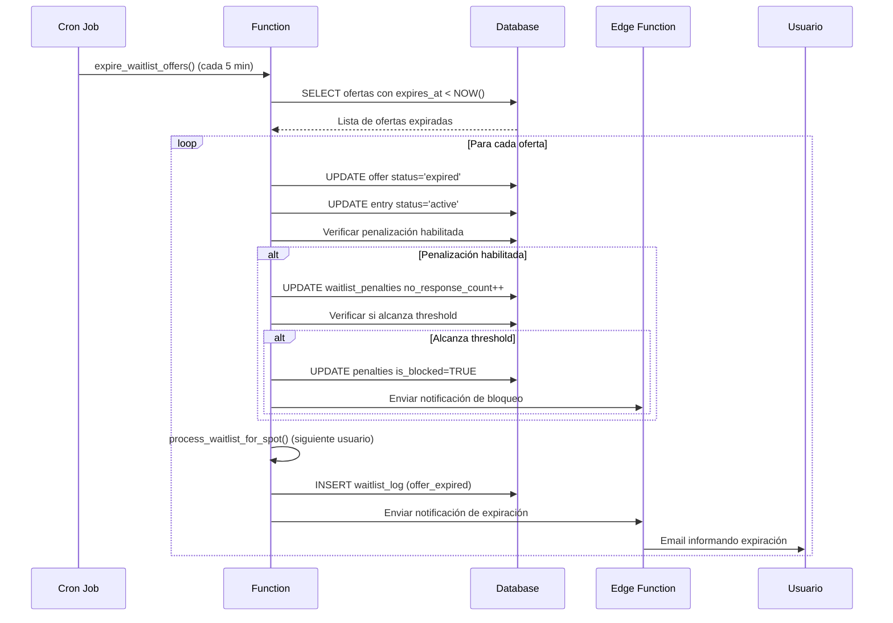
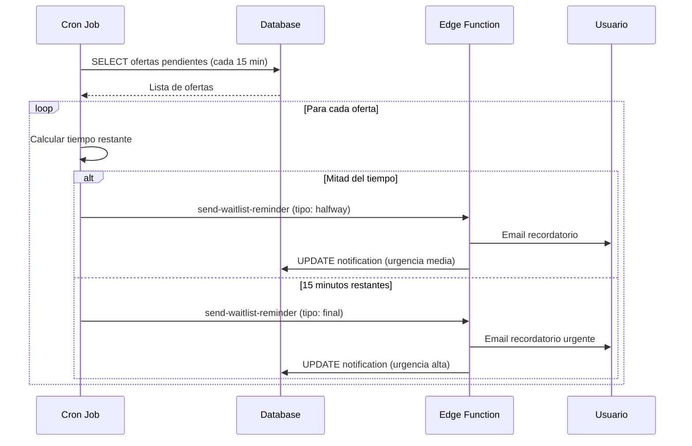
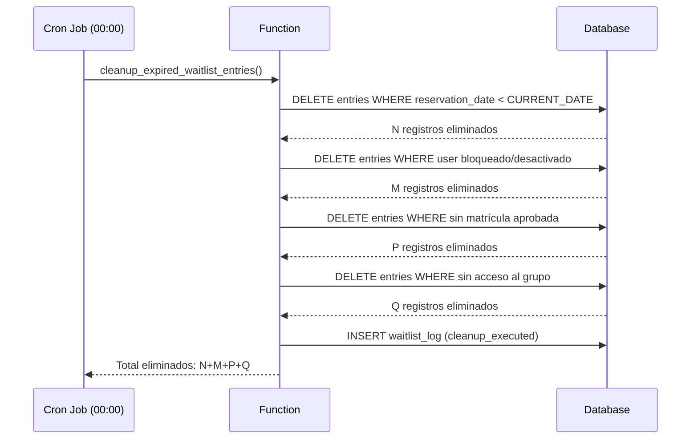

# Design Document - Sistema de Lista de Espera

## Overview

El sistema de lista de espera permite a los usuarios registrarse cuando no hay plazas disponibles y ser notificados automáticamente cuando se libera una plaza. El sistema gestiona ofertas con tiempo limitado, notificaciones multi-canal, y penalizaciones configurables.

### Objetivos Principales

1. **Automatización completa**: Detección de plazas libres, notificación y asignación automática
2. **Justicia**: Sistema FIFO con opción de prioridad por roles
3. **Eficiencia**: Tiempo limitado para aceptar ofertas evita bloqueos
4. **Flexibilidad**: Configuración completa por admin
5. **Transparencia**: Dashboard y estadísticas para admin y usuarios

### Alcance

**Incluye:**
- Registro en lista de espera por grupo y fecha
- Sistema de ofertas con expiración automática
- Notificaciones email + in-app con recordatorios
- Dashboard de usuario y admin
- Sistema de penalización configurable
- Logs y auditoría completa

**No incluye:**
- Notificaciones push móviles (fase futura)
- Sistema de subastas o prioridad por pago
- Lista de espera para rangos de fechas (solo fechas específicas)

## Architecture

### High-Level Architecture

```
┌─────────────────────────────────────────────────────────────┐
│                      Frontend (React)                        │
├─────────────────────────────────────────────────────────────┤
│  - Componente de registro en lista de espera                │
│  - Dashboard de listas activas del usuario                  │
│  - Notificaciones in-app de ofertas                         │
│  - Dashboard admin de estadísticas                          │
└─────────────────────────────────────────────────────────────┘
                            │
                            ▼
┌─────────────────────────────────────────────────────────────┐
│                   Supabase Backend                           │
├─────────────────────────────────────────────────────────────┤
│  Database (PostgreSQL)                                       │
│  - waitlist_entries (entradas de lista de espera)           │
│  - waitlist_offers (ofertas pendientes)                     │
│  - waitlist_logs (auditoría)                                │
│  - reservation_settings (configuración extendida)           │
│                                                              │
│  Functions (SQL)                                             │
│  - process_waitlist_for_spot()                              │
│  - create_waitlist_offer()                                  │
│  - accept_waitlist_offer()                                  │
│  - reject_waitlist_offer()                                  │
│  - expire_waitlist_offers()                                 │
│  - cleanup_expired_waitlist_entries()                       │
│                                                              │
│  Triggers                                                    │
│  - on_reservation_cancelled → process_waitlist              │
│  - on_offer_expired → next_in_queue                         │
│                                                              │
│  Edge Functions (TypeScript)                                │
│  - send-waitlist-notification (email + in-app)              │
│  - send-waitlist-reminder (recordatorios)                   │
│                                                              │
│  Cron Jobs (pg_cron)                                        │
│  - expire_offers_job (cada 5 minutos)                       │
│  - cleanup_old_entries_job (diario a las 00:00)            │
│  - send_reminders_job (cada 15 minutos)                    │
└─────────────────────────────────────────────────────────────┘


## Components and Interfaces

### Frontend Components

#### 1. WaitlistRegistration Component
**Ubicación:** `src/components/waitlist/WaitlistRegistration.tsx`

**Props:**
```typescript
interface WaitlistRegistrationProps {
  date: Date;
  availableGroups: ParkingGroup[];
  onRegister: (groupIds: string[]) => Promise<void>;
}
```

**Funcionalidad:**
- Mostrar cuando no hay plazas disponibles
- Permitir seleccionar grupos específicos o "todos"
- Validar límite de listas simultáneas
- Mostrar posición estimada en cola

#### 2. WaitlistDashboard Component
**Ubicación:** `src/components/waitlist/WaitlistDashboard.tsx`

**Props:**
```typescript
interface WaitlistDashboardProps {
  userId: string;
}
```

**Funcionalidad:**
- Listar todas las entradas activas del usuario
- Mostrar posición en cada cola
- Permitir cancelar registro
- Mostrar ofertas pendientes con countdown

#### 3. WaitlistOfferNotification Component
**Ubicación:** `src/components/waitlist/WaitlistOfferNotification.tsx`

**Props:**
```typescript
interface WaitlistOfferNotificationProps {
  offer: WaitlistOffer;
  onAccept: () => Promise<void>;
  onReject: () => Promise<void>;
}
```

**Funcionalidad:**
- Mostrar detalles de la plaza ofrecida
- Countdown visual del tiempo restante
- Botones de aceptar/rechazar
- Mostrar en modal o toast según contexto

#### 4. AdminWaitlistDashboard Component
**Ubicación:** `src/components/admin/waitlist/AdminWaitlistDashboard.tsx`

**Funcionalidad:**
- Estadísticas globales (usuarios en espera, ofertas pendientes)
- Gráficos de tendencias
- Lista de espera por grupo y fecha
- Gestión manual de entradas
- Configuración de parámetros

### Backend Functions

#### 1. process_waitlist_for_spot()
**Tipo:** SQL Function (SECURITY DEFINER)

```sql
CREATE OR REPLACE FUNCTION process_waitlist_for_spot(
  p_spot_id UUID,
  p_date DATE
) RETURNS VOID
```

**Lógica:**
1. Verificar si hay usuarios en lista de espera para ese spot/fecha
2. Obtener grupo del spot
3. Buscar primer usuario en cola (ordenado por prioridad/timestamp)
4. Verificar que usuario sigue activo y con matrícula aprobada
5. Crear oferta con tiempo de expiración
6. Llamar a Edge Function para enviar notificaciones

#### 2. create_waitlist_offer()
**Tipo:** SQL Function (SECURITY DEFINER)

```sql
CREATE OR REPLACE FUNCTION create_waitlist_offer(
  p_entry_id UUID,
  p_spot_id UUID
) RETURNS UUID
```

**Lógica:**
1. Obtener configuración de tiempo de aceptación
2. Calcular expires_at = NOW() + acceptance_time
3. Insertar en waitlist_offers
4. Actualizar waitlist_entry status a 'offer_pending'
5. Retornar offer_id

#### 3. accept_waitlist_offer()
**Tipo:** SQL Function (SECURITY DEFINER)

```sql
CREATE OR REPLACE FUNCTION accept_waitlist_offer(
  p_offer_id UUID,
  p_user_id UUID
) RETURNS UUID
```

**Lógica:**
1. Verificar que oferta existe y no ha expirado
2. Verificar que usuario es el destinatario
3. Verificar que plaza sigue disponible
4. Crear reserva confirmada
5. Marcar oferta como 'accepted'
6. Eliminar todas las entradas de lista de espera del usuario
7. Registrar en logs
8. Retornar reservation_id

#### 4. reject_waitlist_offer()
**Tipo:** SQL Function (SECURITY DEFINER)

```sql
CREATE OR REPLACE FUNCTION reject_waitlist_offer(
  p_offer_id UUID,
  p_user_id UUID
) RETURNS VOID
```

**Lógica:**
1. Verificar que oferta existe y usuario es destinatario
2. Marcar oferta como 'rejected'
3. Actualizar waitlist_entry status a 'active'
4. Incrementar contador de rechazos si penalización habilitada
5. Llamar a process_waitlist_for_spot() para siguiente usuario
6. Registrar en logs

#### 5. expire_waitlist_offers()
**Tipo:** SQL Function (llamada por cron)

```sql
CREATE OR REPLACE FUNCTION expire_waitlist_offers()
RETURNS INTEGER
```

**Lógica:**
1. Buscar ofertas con expires_at < NOW() y status = 'pending'
2. Para cada oferta:
   - Marcar como 'expired'
   - Actualizar entry status a 'active'
   - Incrementar contador no_respuestas si penalización habilitada
   - Llamar a process_waitlist_for_spot()
3. Retornar número de ofertas expiradas

#### 6. cleanup_expired_waitlist_entries()
**Tipo:** SQL Function (llamada por cron)

```sql
CREATE OR REPLACE FUNCTION cleanup_expired_waitlist_entries()
RETURNS INTEGER
```

**Lógica:**
1. Eliminar entradas con reservation_date < CURRENT_DATE
2. Eliminar entradas de usuarios bloqueados/desactivados
3. Eliminar entradas de usuarios sin matrícula aprobada
4. Retornar número de entradas eliminadas

### Edge Functions

#### 1. send-waitlist-notification
**Ubicación:** `supabase/functions/send-waitlist-notification/index.ts`

**Input:**
```typescript
{
  offerId: string;
  userId: string;
  spotNumber: string;
  groupName: string;
  date: string;
  expiresAt: string;
}
```

**Funcionalidad:**
- Enviar email con detalles de oferta y enlaces de aceptar/rechazar
- Crear notificación in-app
- Programar recordatorios (mitad de tiempo y 15 min antes)

#### 2. send-waitlist-reminder
**Ubicación:** `supabase/functions/send-waitlist-reminder/index.ts`

**Input:**
```typescript
{
  offerId: string;
  userId: string;
  timeRemaining: number; // minutos
}
```

**Funcionalidad:**
- Enviar email de recordatorio
- Actualizar notificación in-app con urgencia


## Data Models

### 1. waitlist_entries

Almacena las entradas de usuarios en listas de espera.

```sql
CREATE TABLE public.waitlist_entries (
  id UUID PRIMARY KEY DEFAULT gen_random_uuid(),
  user_id UUID NOT NULL REFERENCES auth.users(id) ON DELETE CASCADE,
  group_id UUID NOT NULL REFERENCES public.parking_groups(id) ON DELETE CASCADE,
  reservation_date DATE NOT NULL,
  status TEXT NOT NULL DEFAULT 'active' 
    CHECK (status IN ('active', 'offer_pending', 'completed', 'cancelled')),
  position INTEGER, -- Calculado dinámicamente, puede ser NULL
  created_at TIMESTAMPTZ NOT NULL DEFAULT NOW(),
  updated_at TIMESTAMPTZ NOT NULL DEFAULT NOW(),
  
  -- Un usuario solo puede estar una vez en lista de espera por grupo/fecha
  UNIQUE(user_id, group_id, reservation_date)
);

CREATE INDEX idx_waitlist_entries_group_date 
  ON waitlist_entries(group_id, reservation_date, status, created_at);
CREATE INDEX idx_waitlist_entries_user 
  ON waitlist_entries(user_id, status);
```

**Campos:**
- `id`: Identificador único
- `user_id`: Usuario en lista de espera
- `group_id`: Grupo de parking
- `reservation_date`: Fecha deseada
- `status`: Estado de la entrada
  - `active`: En espera
  - `offer_pending`: Tiene oferta pendiente
  - `completed`: Aceptó oferta y tiene reserva
  - `cancelled`: Cancelada por usuario o sistema
- `position`: Posición en cola (calculada, puede ser NULL)
- `created_at`: Timestamp de registro
- `updated_at`: Última actualización

### 2. waitlist_offers

Almacena ofertas de reserva enviadas a usuarios.

```sql
CREATE TABLE public.waitlist_offers (
  id UUID PRIMARY KEY DEFAULT gen_random_uuid(),
  entry_id UUID NOT NULL REFERENCES public.waitlist_entries(id) ON DELETE CASCADE,
  user_id UUID NOT NULL REFERENCES auth.users(id) ON DELETE CASCADE,
  spot_id UUID NOT NULL REFERENCES public.parking_spots(id) ON DELETE CASCADE,
  reservation_date DATE NOT NULL,
  status TEXT NOT NULL DEFAULT 'pending'
    CHECK (status IN ('pending', 'accepted', 'rejected', 'expired')),
  created_at TIMESTAMPTZ NOT NULL DEFAULT NOW(),
  expires_at TIMESTAMPTZ NOT NULL,
  responded_at TIMESTAMPTZ,
  
  -- Solo una oferta pendiente por entrada
  UNIQUE(entry_id, status) WHERE status = 'pending'
);

CREATE INDEX idx_waitlist_offers_user_status 
  ON waitlist_offers(user_id, status);
CREATE INDEX idx_waitlist_offers_expires 
  ON waitlist_offers(expires_at) WHERE status = 'pending';
```

**Campos:**
- `id`: Identificador único
- `entry_id`: Entrada de lista de espera asociada
- `user_id`: Usuario destinatario
- `spot_id`: Plaza ofrecida
- `reservation_date`: Fecha de la reserva
- `status`: Estado de la oferta
  - `pending`: Esperando respuesta
  - `accepted`: Usuario aceptó
  - `rejected`: Usuario rechazó
  - `expired`: Tiempo expirado sin respuesta
- `created_at`: Timestamp de creación
- `expires_at`: Timestamp de expiración
- `responded_at`: Timestamp de respuesta (accept/reject)

### 3. waitlist_logs

Auditoría de todas las operaciones de lista de espera.

```sql
CREATE TABLE public.waitlist_logs (
  id UUID PRIMARY KEY DEFAULT gen_random_uuid(),
  user_id UUID REFERENCES auth.users(id) ON DELETE SET NULL,
  entry_id UUID REFERENCES public.waitlist_entries(id) ON DELETE SET NULL,
  offer_id UUID REFERENCES public.waitlist_offers(id) ON DELETE SET NULL,
  action TEXT NOT NULL CHECK (action IN (
    'entry_created', 'entry_cancelled', 'offer_created', 
    'offer_accepted', 'offer_rejected', 'offer_expired',
    'penalty_applied', 'cleanup_executed'
  )),
  details JSONB,
  created_at TIMESTAMPTZ NOT NULL DEFAULT NOW()
);

CREATE INDEX idx_waitlist_logs_user 
  ON waitlist_logs(user_id, created_at DESC);
CREATE INDEX idx_waitlist_logs_action 
  ON waitlist_logs(action, created_at DESC);
```

**Campos:**
- `id`: Identificador único
- `user_id`: Usuario relacionado (puede ser NULL si fue eliminado)
- `entry_id`: Entrada relacionada (puede ser NULL)
- `offer_id`: Oferta relacionada (puede ser NULL)
- `action`: Tipo de acción registrada
- `details`: Información adicional en JSON
- `created_at`: Timestamp del evento

### 4. waitlist_penalties

Almacena penalizaciones de usuarios por no responder ofertas.

```sql
CREATE TABLE public.waitlist_penalties (
  id UUID PRIMARY KEY DEFAULT gen_random_uuid(),
  user_id UUID NOT NULL REFERENCES auth.users(id) ON DELETE CASCADE,
  rejection_count INTEGER NOT NULL DEFAULT 0,
  no_response_count INTEGER NOT NULL DEFAULT 0,
  is_blocked BOOLEAN NOT NULL DEFAULT FALSE,
  blocked_until TIMESTAMPTZ,
  last_reset_at TIMESTAMPTZ NOT NULL DEFAULT NOW(),
  created_at TIMESTAMPTZ NOT NULL DEFAULT NOW(),
  updated_at TIMESTAMPTZ NOT NULL DEFAULT NOW(),
  
  UNIQUE(user_id)
);

CREATE INDEX idx_waitlist_penalties_blocked 
  ON waitlist_penalties(user_id) WHERE is_blocked = TRUE;
```

**Campos:**
- `id`: Identificador único
- `user_id`: Usuario penalizado
- `rejection_count`: Número de rechazos en el período actual
- `no_response_count`: Número de no respuestas en el período actual
- `is_blocked`: Si está bloqueado temporalmente
- `blocked_until`: Timestamp hasta cuando está bloqueado
- `last_reset_at`: Última vez que se resetearon contadores
- `created_at`: Timestamp de creación
- `updated_at`: Última actualización

### 5. reservation_settings (extendida)

Añadir campos de configuración de lista de espera a la tabla existente.

```sql
ALTER TABLE public.reservation_settings
ADD COLUMN waitlist_enabled BOOLEAN NOT NULL DEFAULT FALSE,
ADD COLUMN waitlist_acceptance_time_minutes INTEGER NOT NULL DEFAULT 120 
  CHECK (waitlist_acceptance_time_minutes >= 30 AND waitlist_acceptance_time_minutes <= 1440),
ADD COLUMN waitlist_max_simultaneous INTEGER NOT NULL DEFAULT 5
  CHECK (waitlist_max_simultaneous >= 1 AND waitlist_max_simultaneous <= 10),
ADD COLUMN waitlist_priority_by_role BOOLEAN NOT NULL DEFAULT FALSE,
ADD COLUMN waitlist_penalty_enabled BOOLEAN NOT NULL DEFAULT FALSE,
ADD COLUMN waitlist_penalty_threshold INTEGER NOT NULL DEFAULT 3
  CHECK (waitlist_penalty_threshold >= 2 AND waitlist_penalty_threshold <= 10),
ADD COLUMN waitlist_penalty_duration_days INTEGER NOT NULL DEFAULT 7
  CHECK (waitlist_penalty_duration_days >= 1 AND waitlist_penalty_duration_days <= 30);
```

**Nuevos campos:**
- `waitlist_enabled`: Habilitar/deshabilitar sistema globalmente
- `waitlist_acceptance_time_minutes`: Tiempo para aceptar oferta (30-1440 min)
- `waitlist_max_simultaneous`: Máximo de listas simultáneas por usuario (1-10)
- `waitlist_priority_by_role`: Usar prioridad de roles en cola
- `waitlist_penalty_enabled`: Habilitar sistema de penalización
- `waitlist_penalty_threshold`: Umbral de no respuestas para bloqueo (2-10)
- `waitlist_penalty_duration_days`: Duración del bloqueo temporal (1-30 días)

### 6. notifications (nueva tabla)

Sistema de notificaciones in-app.

```sql
CREATE TABLE public.notifications (
  id UUID PRIMARY KEY DEFAULT gen_random_uuid(),
  user_id UUID NOT NULL REFERENCES auth.users(id) ON DELETE CASCADE,
  type TEXT NOT NULL CHECK (type IN (
    'waitlist_offer', 'waitlist_reminder', 'waitlist_expired',
    'waitlist_accepted', 'waitlist_penalty'
  )),
  title TEXT NOT NULL,
  message TEXT NOT NULL,
  data JSONB, -- Datos adicionales (offer_id, etc.)
  is_read BOOLEAN NOT NULL DEFAULT FALSE,
  created_at TIMESTAMPTZ NOT NULL DEFAULT NOW(),
  read_at TIMESTAMPTZ
);

CREATE INDEX idx_notifications_user_unread 
  ON notifications(user_id, is_read, created_at DESC);
```

**Campos:**
- `id`: Identificador único
- `user_id`: Usuario destinatario
- `type`: Tipo de notificación
- `title`: Título de la notificación
- `message`: Mensaje completo
- `data`: Datos adicionales en JSON (offer_id, enlaces, etc.)
- `is_read`: Si fue leída
- `created_at`: Timestamp de creación
- `read_at`: Timestamp de lectura


## Flow Diagrams

### 1. Flujo de Registro en Lista de Espera



### 2. Flujo de Liberación de Plaza y Oferta



### 3. Flujo de Aceptación de Oferta



### 4. Flujo de Expiración de Oferta



### 5. Flujo de Recordatorios



### 6. Flujo de Limpieza Automática



## Error Handling

### Errores de Validación

**1. Usuario excede límite de listas simultáneas**
```typescript
{
  code: 'WAITLIST_LIMIT_EXCEEDED',
  message: 'Has alcanzado el límite de listas de espera simultáneas',
  details: { current: 5, max: 5 }
}
```

**2. Usuario bloqueado por penalización**
```typescript
{
  code: 'WAITLIST_USER_BLOCKED',
  message: 'Estás bloqueado temporalmente de lista de espera',
  details: { blockedUntil: '2025-11-20T10:00:00Z' }
}
```

**3. Oferta ya expirada**
```typescript
{
  code: 'WAITLIST_OFFER_EXPIRED',
  message: 'Esta oferta ha expirado',
  details: { expiredAt: '2025-11-14T12:00:00Z' }
}
```

**4. Plaza ya no disponible**
```typescript
{
  code: 'SPOT_NO_LONGER_AVAILABLE',
  message: 'La plaza ya no está disponible',
  details: { spotId: 'uuid', date: '2025-11-15' }
}
```

### Manejo de Conflictos

**Conflicto de reserva simultánea:**
- Si dos usuarios aceptan ofertas para la misma plaza simultáneamente
- El primero en confirmar gana (constraint UNIQUE en reservations)
- El segundo recibe error y se busca siguiente plaza disponible

**Conflicto de usuario eliminado:**
- Si usuario es eliminado mientras tiene oferta pendiente
- ON DELETE CASCADE elimina automáticamente entradas y ofertas
- Trigger busca siguiente usuario en cola

**Conflicto de grupo desactivado:**
- Si grupo es desactivado mientras hay lista de espera
- Limpieza automática elimina entradas de ese grupo
- Usuarios son notificados de la cancelación

### Logging de Errores

Todos los errores críticos se registran en `waitlist_logs`:

```sql
INSERT INTO waitlist_logs (action, details)
VALUES ('error_occurred', jsonb_build_object(
  'error_code', 'SPOT_NO_LONGER_AVAILABLE',
  'user_id', user_id,
  'offer_id', offer_id,
  'timestamp', NOW()
));
```


## Testing Strategy

### Unit Tests

**Backend Functions:**
- `process_waitlist_for_spot()`: Verificar orden correcto de cola
- `create_waitlist_offer()`: Validar cálculo de expires_at
- `accept_waitlist_offer()`: Verificar creación de reserva y limpieza
- `reject_waitlist_offer()`: Verificar que pasa al siguiente
- `expire_waitlist_offers()`: Verificar detección de ofertas expiradas
- `cleanup_expired_waitlist_entries()`: Verificar eliminación correcta

**Frontend Components:**
- `WaitlistRegistration`: Validación de límites y selección de grupos
- `WaitlistDashboard`: Renderizado correcto de entradas
- `WaitlistOfferNotification`: Countdown y botones funcionales
- `AdminWaitlistDashboard`: Estadísticas y gráficos

### Integration Tests

**Flujo completo de lista de espera:**
1. Usuario se registra en lista de espera
2. Otro usuario cancela reserva
3. Sistema detecta plaza libre y crea oferta
4. Usuario recibe notificación
5. Usuario acepta oferta
6. Reserva se crea correctamente
7. Usuario sale de todas las listas

**Flujo de expiración:**
1. Usuario recibe oferta
2. No responde en tiempo límite
3. Cron job detecta expiración
4. Sistema marca oferta como expirada
5. Sistema busca siguiente usuario
6. Penalización se aplica si está habilitada

**Flujo de prioridad por roles:**
1. Usuarios con diferentes roles se registran
2. Plaza se libera
3. Sistema ofrece a usuario con mayor prioridad
4. Verificar orden correcto

### End-to-End Tests

**Escenario 1: Usuario exitoso**
- Registrarse en lista de espera
- Recibir oferta
- Aceptar oferta
- Verificar reserva creada
- Verificar salida de listas

**Escenario 2: Usuario rechaza**
- Registrarse en lista de espera
- Recibir oferta
- Rechazar oferta
- Verificar que sigue en lista
- Verificar que siguiente usuario recibe oferta

**Escenario 3: Penalización**
- No responder 3 ofertas
- Verificar bloqueo temporal
- Intentar registrarse en lista
- Verificar mensaje de bloqueo

**Escenario 4: Admin gestiona listas**
- Ver dashboard de estadísticas
- Filtrar por grupo y fecha
- Eliminar entrada manualmente
- Cambiar configuración
- Verificar cambios aplicados

### Performance Tests

**Carga de usuarios en lista:**
- 1000 usuarios en lista de espera
- Verificar tiempo de búsqueda del primero
- Objetivo: < 100ms

**Procesamiento de ofertas expiradas:**
- 100 ofertas expiradas simultáneas
- Verificar tiempo de procesamiento
- Objetivo: < 5 segundos

**Notificaciones masivas:**
- 50 ofertas creadas simultáneamente
- Verificar envío de emails
- Objetivo: < 30 segundos

### Security Tests

**RLS Policies:**
- Usuario solo ve sus propias entradas
- Usuario solo puede aceptar sus propias ofertas
- Admin puede ver todas las entradas
- Usuario anónimo no tiene acceso

**Validaciones:**
- No exceder límite de listas simultáneas
- No registrarse si está bloqueado
- No aceptar oferta expirada
- No aceptar oferta de otro usuario

## Performance Considerations

### Database Optimization

**Índices críticos:**
```sql
-- Búsqueda rápida de primer usuario en cola
CREATE INDEX idx_waitlist_entries_queue 
  ON waitlist_entries(group_id, reservation_date, status, created_at)
  WHERE status = 'active';

-- Búsqueda rápida de ofertas a expirar
CREATE INDEX idx_waitlist_offers_expiring 
  ON waitlist_offers(expires_at)
  WHERE status = 'pending';

-- Búsqueda rápida de notificaciones no leídas
CREATE INDEX idx_notifications_unread 
  ON notifications(user_id, created_at DESC)
  WHERE is_read = FALSE;
```

**Particionamiento (futuro):**
- Particionar `waitlist_logs` por mes
- Archivar logs antiguos después de 12 meses

### Caching Strategy

**Frontend:**
- Cache de configuración de lista de espera (5 minutos)
- Cache de posición en cola (30 segundos)
- Real-time updates para ofertas pendientes

**Backend:**
- Cache de configuración en memoria (Edge Functions)
- Invalidar cache al cambiar configuración

### Rate Limiting

**Endpoints críticos:**
- Registro en lista de espera: 10 requests/minuto por usuario
- Aceptar/rechazar oferta: 5 requests/minuto por usuario
- Dashboard admin: 30 requests/minuto

### Monitoring

**Métricas clave:**
- Número de usuarios en lista de espera (por grupo)
- Tasa de aceptación de ofertas
- Tasa de expiración de ofertas
- Tiempo promedio en lista de espera
- Número de penalizaciones aplicadas

**Alertas:**
- Más de 100 usuarios en lista de espera en un grupo
- Tasa de aceptación < 50%
- Tasa de expiración > 30%
- Cron jobs fallando

## Security Considerations

### Row Level Security (RLS)

**waitlist_entries:**
```sql
-- Usuarios ven solo sus entradas
CREATE POLICY "Users view own entries"
  ON waitlist_entries FOR SELECT
  TO authenticated
  USING (auth.uid() = user_id);

-- Admins ven todas
CREATE POLICY "Admins view all entries"
  ON waitlist_entries FOR SELECT
  TO authenticated
  USING (is_admin(auth.uid()));

-- Usuarios crean sus entradas
CREATE POLICY "Users create own entries"
  ON waitlist_entries FOR INSERT
  TO authenticated
  WITH CHECK (auth.uid() = user_id);

-- Usuarios cancelan sus entradas
CREATE POLICY "Users cancel own entries"
  ON waitlist_entries FOR UPDATE
  TO authenticated
  USING (auth.uid() = user_id)
  WITH CHECK (auth.uid() = user_id);
```

**waitlist_offers:**
```sql
-- Usuarios ven solo sus ofertas
CREATE POLICY "Users view own offers"
  ON waitlist_offers FOR SELECT
  TO authenticated
  USING (auth.uid() = user_id);

-- Admins ven todas
CREATE POLICY "Admins view all offers"
  ON waitlist_offers FOR SELECT
  TO authenticated
  USING (is_admin(auth.uid()));

-- Solo funciones pueden crear ofertas
CREATE POLICY "Only functions create offers"
  ON waitlist_offers FOR INSERT
  TO authenticated
  WITH CHECK (FALSE); -- Solo via SECURITY DEFINER functions
```

**notifications:**
```sql
-- Usuarios ven solo sus notificaciones
CREATE POLICY "Users view own notifications"
  ON notifications FOR SELECT
  TO authenticated
  USING (auth.uid() = user_id);

-- Usuarios marcan como leídas
CREATE POLICY "Users mark own as read"
  ON notifications FOR UPDATE
  TO authenticated
  USING (auth.uid() = user_id)
  WITH CHECK (auth.uid() = user_id AND is_read = TRUE);
```

### Input Validation

**Frontend:**
- Validar selección de grupos (deben ser grupos asignados al usuario)
- Validar fecha (debe estar en rango permitido)
- Sanitizar inputs antes de enviar

**Backend:**
- Validar que usuario tiene matrícula aprobada
- Validar que usuario tiene acceso al grupo
- Validar que no excede límite de listas
- Validar que no está bloqueado

### API Security

**Edge Functions:**
- Verificar autenticación en cada request
- Validar tokens JWT
- Rate limiting por usuario
- Logging de todas las operaciones

## Migration Strategy

### Phase 1: Database Schema (Week 1)
1. Crear tablas nuevas (waitlist_entries, waitlist_offers, waitlist_logs, waitlist_penalties, notifications)
2. Extender reservation_settings con campos de lista de espera
3. Crear índices
4. Aplicar RLS policies
5. Crear funciones SQL básicas

### Phase 2: Backend Logic (Week 2)
1. Implementar funciones SQL completas
2. Crear triggers
3. Configurar cron jobs
4. Implementar Edge Functions
5. Testing de backend

### Phase 3: Frontend Components (Week 3)
1. Componente de registro en lista de espera
2. Dashboard de usuario
3. Notificaciones in-app
4. Testing de componentes

### Phase 4: Admin Dashboard (Week 4)
1. Dashboard de estadísticas
2. Gestión de listas
3. Configuración de parámetros
4. Testing de admin

### Phase 5: Integration & Testing (Week 5)
1. Integration tests
2. E2E tests
3. Performance tests
4. Security audit
5. Bug fixes

### Phase 6: Deployment (Week 6)
1. Deploy a staging
2. User acceptance testing
3. Deploy a producción
4. Monitoring y ajustes

## Future Enhancements

### Phase 2 Features (Post-MVP)

**1. Notificaciones Push Móviles**
- Integración con Firebase Cloud Messaging
- Notificaciones push para ofertas
- Configuración de preferencias de notificación

**2. Lista de Espera por Rango de Fechas**
- Registrarse para "cualquier día de la semana"
- Registrarse para "próximos 7 días"
- Mayor flexibilidad para usuarios

**3. Prioridad Dinámica**
- Usuarios que esperan más tiempo suben en prioridad
- Bonus de prioridad por buen comportamiento
- Sistema de puntos

**4. Predicción de Disponibilidad**
- ML para predecir probabilidad de conseguir plaza
- Sugerencias de fechas alternativas
- Análisis de patrones de cancelación

**5. Marketplace de Plazas**
- Usuarios pueden intercambiar plazas
- Sistema de créditos
- Subastas opcionales

**6. Integración con Calendario**
- Sincronización con Google Calendar
- Recordatorios automáticos
- Bloqueo de fechas en calendario personal
