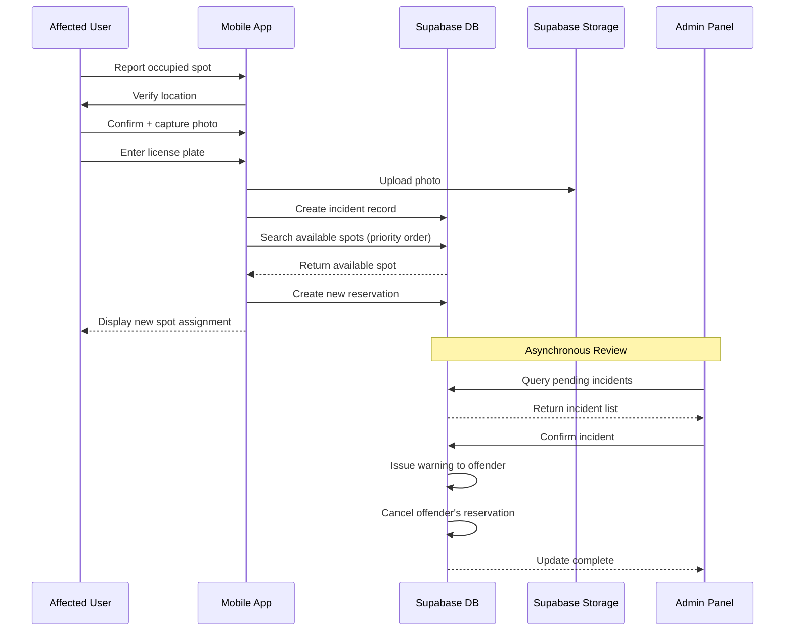

# Design Document - Parking Spot Incident Reporting

## Overview

This document outlines the technical design for the parking spot incident reporting system. The feature enables users to report when their reserved parking spot is occupied, automatically reassigns them to an available spot, and provides administrators with tools to review incidents and issue warnings to offending users.

The system is designed to work in real-time for users (immediate reassignment) while allowing asynchronous administrative review and disciplinary action.

## Architecture

### High-Level Flow



### Component Architecture

```
src/
├── components/
│   ├── incidents/                    # New incident reporting components
│   │   ├── IncidentReportFlow.tsx   # Main orchestrator component
│   │   ├── LocationVerification.tsx  # Step 1: Verify location
│   │   ├── EvidenceCapture.tsx      # Step 2: Photo + license plate
│   │   ├── SpotReassignment.tsx     # Step 3: Show new assignment
│   │   └── IncidentCancellation.tsx # Cancel flow dialog
│   └── admin/
│       └── incidents/                # Admin incident management
│           ├── IncidentList.tsx     # List of pending incidents
│           ├── IncidentDetails.tsx  # Detailed incident view
│           └── IncidentActions.tsx  # Confirm/Dismiss actions
├── hooks/
│   ├── useIncidentReport.ts         # User incident reporting logic
│   └── admin/
│       └── useIncidentManagement.ts # Admin incident review logic
├── types/
│   └── incidents.ts                 # TypeScript types
└── lib/
    └── incidentHelpers.ts           # Utility functions
```

## Data Models

### Database Schema Changes

#### 1. Extend `incident_reports` Table

The existing table needs additional columns:

```sql
-- Migration: Add incident reporting fields
ALTER TABLE public.incident_reports
  ADD COLUMN offending_license_plate TEXT,
  ADD COLUMN offending_user_id UUID REFERENCES auth.users(id),
  ADD COLUMN original_spot_id UUID REFERENCES public.parking_spots(id),
  ADD COLUMN reassigned_spot_id UUID REFERENCES public.parking_spots(id),
  ADD COLUMN reassigned_reservation_id UUID REFERENCES public.reservations(id),
  ADD COLUMN photo_url TEXT,
  ADD COLUMN admin_notes TEXT,
  ADD COLUMN confirmed_by UUID REFERENCES auth.users(id),
  ADD COLUMN confirmed_at TIMESTAMP WITH TIME ZONE;

-- Update status check constraint
ALTER TABLE public.incident_reports
  DROP CONSTRAINT IF EXISTS incident_reports_status_check;

ALTER TABLE public.incident_reports
  ADD CONSTRAINT incident_reports_status_check
  CHECK (status IN ('pending', 'confirmed', 'dismissed'));

-- Add index for license plate lookups
CREATE INDEX idx_incident_reports_offending_license_plate
  ON public.incident_reports(offending_license_plate);

-- Add index for status filtering
CREATE INDEX idx_incident_reports_status
  ON public.incident_reports(status);
```

#### 2. Create `user_warnings` Table

New table to track warnings issued to users:

```sql
-- Migration: Create user warnings table
CREATE TABLE public.user_warnings (
  id UUID PRIMARY KEY DEFAULT gen_random_uuid(),
  user_id UUID NOT NULL REFERENCES auth.users(id) ON DELETE CASCADE,
  incident_id UUID NOT NULL REFERENCES public.incident_reports(id) ON DELETE CASCADE,
  issued_by UUID NOT NULL REFERENCES auth.users(id),
  issued_at TIMESTAMP WITH TIME ZONE DEFAULT NOW(),
  reason TEXT NOT NULL,
  notes TEXT
);

ALTER TABLE public.user_warnings ENABLE ROW LEVEL SECURITY;

-- RLS Policies
CREATE POLICY "Users can view their own warnings"
  ON public.user_warnings FOR SELECT
  TO authenticated
  USING (auth.uid() = user_id);

CREATE POLICY "Admins can view all warnings"
  ON public.user_warnings FOR SELECT
  TO authenticated
  USING (public.is_admin(auth.uid()));

CREATE POLICY "Admins can create warnings"
  ON public.user_warnings FOR INSERT
  TO authenticated
  WITH CHECK (public.is_admin(auth.uid()));

-- Index for user warning count queries
CREATE INDEX idx_user_warnings_user_id
  ON public.user_warnings(user_id);
```

#### 3. Add `is_incident_reserve` to `parking_groups`

```sql
-- Migration: Add incident reserve flag to parking groups
ALTER TABLE public.parking_groups
  ADD COLUMN is_incident_reserve BOOLEAN DEFAULT FALSE;

-- Index for incident reserve group queries
CREATE INDEX idx_parking_groups_incident_reserve
  ON public.parking_groups(is_incident_reserve)
  WHERE is_incident_reserve = TRUE;
```

### TypeScript Types

```typescript
// src/types/incidents.ts

export type IncidentStatus = 'pending' | 'confirmed' | 'dismissed';

export interface IncidentReport {
  id: string;
  reservation_id: string;
  reporter_id: string;
  description: string;
  status: IncidentStatus;
  offending_license_plate: string | null;
  offending_user_id: string | null;
  original_spot_id: string | null;
  reassigned_spot_id: string | null;
  reassigned_reservation_id: string | null;
  photo_url: string | null;
  admin_notes: string | null;
  confirmed_by: string | null;
  confirmed_at: string | null;
  created_at: string;
  resolved_at: string | null;
}

export interface IncidentReportWithDetails extends IncidentReport {
  reporter: {
    id: string;
    full_name: string;
    email: string;
  };
  offending_user: {
    id: string;
    full_name: string;
    email: string;
  } | null;
  original_spot: {
    spot_number: string;
    group_name: string;
  } | null;
  reassigned_spot: {
    spot_number: string;
    group_name: string;
  } | null;
}

export interface UserWarning {
  id: string;
  user_id: string;
  incident_id: string;
  issued_by: string;
  issued_at: string;
  reason: string;
  notes: string | null;
}

export interface IncidentReportFormData {
  reservationId: string;
  originalSpotId: string;
  description: string;
  offendingLicensePlate: string;
  photoFile: File;
}

export interface SpotReassignmentResult {
  success: boolean;
  reassignedSpotId: string | null;
  reassignedSpotNumber: string | null;
  groupName: string | null;
  errorMessage: string | null;
}
```

## Components and Interfaces

### User-Facing Components

#### 1. IncidentReportFlow.tsx

Main orchestrator component that manages the multi-step incident reporting process.

**Props:**
```typescript
interface IncidentReportFlowProps {
  reservationId: string;
  spotId: string;
  spotNumber: string;
  groupName: string;
  reservationDate: string;
  onComplete: () => void;
  onCancel: () => void;
}
```

**State Management:**
- Current step (verification, evidence, reassignment)
- Form data accumulation
- Loading states
- Error handling

**Responsibilities:**
- Coordinate step transitions
- Accumulate form data across steps
- Handle cancellation with confirmation
- Trigger final submission

#### 2. LocationVerification.tsx

First step: Verify user is at correct location.

**Props:**
```typescript
interface LocationVerificationProps {
  spotNumber: string;
  groupName: string;
  onConfirm: () => void;
  onCancel: () => void;
}
```

**UI Elements:**
- Display reserved spot details
- Confirmation question
- "Yes, I'm at the correct spot" button
- "No, show me directions" button
- Cancel button

#### 3. EvidenceCapture.tsx

Second step: Capture photo and license plate.

**Props:**
```typescript
interface EvidenceCaptureProps {
  onSubmit: (photo: File, licensePlate: string) => void;
  onBack: () => void;
  onCancel: () => void;
}
```

**UI Elements:**
- Camera capture button (mobile)
- File upload button (desktop/fallback)
- Photo preview
- Retake/reselect option
- License plate input field
- Validation feedback
- Submit button

**Validation:**
- Image file type (JPEG, PNG, HEIC)
- Max file size (10MB)
- License plate format (non-empty, reasonable length)

#### 4. SpotReassignment.tsx

Third step: Display reassigned spot.

**Props:**
```typescript
interface SpotReassignmentProps {
  reassignedSpotNumber: string;
  groupName: string;
  positionX: number | null;
  positionY: number | null;
  floorPlanUrl: string | null;
  onComplete: () => void;
}
```

**UI Elements:**
- Success message
- New spot details (number, location)
- Mini map with spot highlighted (if available)
- "Go to my new spot" button
- Incident reference number

### Admin Components

#### 1. IncidentList.tsx

List view of all incidents with filtering.

**Props:**
```typescript
interface IncidentListProps {
  onSelectIncident: (incidentId: string) => void;
}
```

**Features:**
- Filter by status (pending, confirmed, dismissed)
- Sort by date
- Search by user name or license plate
- Display key info: reporter, date, status
- Highlight pending incidents
- Show warning count for offending users

#### 2. IncidentDetails.tsx

Detailed view of a single incident.

**Props:**
```typescript
interface IncidentDetailsProps {
  incidentId: string;
  onClose: () => void;
  onUpdate: () => void;
}
```

**Display Sections:**
- Reporter information
- Original spot details
- Reassigned spot details
- Offending user information (if identified)
- Photo evidence (full size)
- License plate
- Timestamps
- Admin notes (editable)
- Action buttons (confirm/dismiss)

#### 3. IncidentActions.tsx

Action buttons and confirmation dialogs.

**Props:**
```typescript
interface IncidentActionsProps {
  incidentId: string;
  offendingUserId: string | null;
  onConfirm: () => void;
  onDismiss: () => void;
}
```

**Actions:**
- Confirm incident (with warning issuance)
- Dismiss incident
- Add/edit admin notes
- View offending user's warning history

## Business Logic

### Spot Reassignment Algorithm

**Function:** `findAvailableSpotForIncident(userId: string, date: string, originalSpotId: string)`

**Priority Order:**
1. Query user's accessible groups (via `user_group_assignments`)
2. Search for available spots in general groups (where `is_incident_reserve = false`)
   - Filter by date availability
   - Exclude original spot
   - Order by group priority (if applicable)
3. If no spots found, search incident reserve groups (where `is_incident_reserve = true`)
   - Same filters as above
4. Return first available spot or null

**SQL Function:**
```sql
CREATE OR REPLACE FUNCTION find_available_spot_for_incident(
  _user_id UUID,
  _date DATE,
  _original_spot_id UUID
)
RETURNS TABLE (
  spot_id UUID,
  spot_number TEXT,
  group_id UUID,
  group_name TEXT,
  position_x NUMERIC,
  position_y NUMERIC
) AS $$
BEGIN
  -- First try general groups
  RETURN QUERY
  SELECT 
    ps.id,
    ps.spot_number,
    pg.id,
    pg.name,
    ps.position_x,
    ps.position_y
  FROM parking_spots ps
  JOIN parking_groups pg ON ps.group_id = pg.id
  JOIN user_group_assignments uga ON pg.id = uga.group_id
  WHERE uga.user_id = _user_id
    AND ps.is_active = TRUE
    AND pg.is_active = TRUE
    AND pg.is_incident_reserve = FALSE
    AND ps.id != _original_spot_id
    AND NOT EXISTS (
      SELECT 1 FROM reservations r
      WHERE r.spot_id = ps.id
        AND r.reservation_date = _date
        AND r.status = 'active'
    )
  LIMIT 1;
  
  -- If no result, try incident reserve groups
  IF NOT FOUND THEN
    RETURN QUERY
    SELECT 
      ps.id,
      ps.spot_number,
      pg.id,
      pg.name,
      ps.position_x,
      ps.position_y
    FROM parking_spots ps
    JOIN parking_groups pg ON ps.group_id = pg.id
    JOIN user_group_assignments uga ON pg.id = uga.group_id
    WHERE uga.user_id = _user_id
      AND ps.is_active = TRUE
      AND pg.is_active = TRUE
      AND pg.is_incident_reserve = TRUE
      AND ps.id != _original_spot_id
      AND NOT EXISTS (
        SELECT 1 FROM reservations r
        WHERE r.spot_id = ps.id
          AND r.reservation_date = _date
          AND r.status = 'active'
      )
    LIMIT 1;
  END IF;
END;
$$ LANGUAGE plpgsql SECURITY DEFINER;
```

### License Plate Matching

**Function:** `findUserByLicensePlate(licensePlate: string)`

**Logic:**
1. Query `license_plates` table for matching plate number
2. Filter by `is_approved = true` and `deleted_at IS NULL`
3. Return `user_id` if found, null otherwise

**SQL Query:**
```sql
SELECT user_id
FROM license_plates
WHERE UPPER(plate_number) = UPPER($1)
  AND is_approved = TRUE
  AND deleted_at IS NULL
LIMIT 1;
```

### Warning Issuance

**Function:** `issueWarningToUser(userId: string, incidentId: string, adminId: string)`

**Steps:**
1. Create record in `user_warnings` table
2. Link to incident report
3. Set reason as "Occupied another user's reserved parking spot"
4. Return warning ID

### Incident Confirmation Flow

**Function:** `confirmIncident(incidentId: string, adminId: string, notes: string)`

**Transaction Steps:**
1. Update incident status to 'confirmed'
2. Set `confirmed_by` and `confirmed_at`
3. Add admin notes
4. If offending user identified:
   - Issue warning via `issueWarningToUser()`
   - Cancel offending user's reservation for that date
   - Log cancellation in `reservation_cancellation_log`
5. Send notification to offending user (if applicable)
6. Commit transaction

## Storage

### Photo Evidence Storage

**Bucket:** `incident-photos` (new bucket)

**Structure:**
```
incident-photos/
  ├── {year}/
  │   ├── {month}/
  │   │   ├── {incident-id}.jpg
```

**Upload Process:**
1. Compress image on client (if > 2MB)
2. Generate unique filename: `{incidentId}.{extension}`
3. Upload to Supabase Storage
4. Store public URL in `incident_reports.photo_url`

**RLS Policies:**
```sql
-- Users can upload photos for their own incidents
CREATE POLICY "Users can upload incident photos"
  ON storage.objects FOR INSERT
  TO authenticated
  WITH CHECK (
    bucket_id = 'incident-photos' AND
    auth.uid()::text = (storage.foldername(name))[1]
  );

-- Users can view their own incident photos
CREATE POLICY "Users can view their incident photos"
  ON storage.objects FOR SELECT
  TO authenticated
  USING (
    bucket_id = 'incident-photos' AND
    (auth.uid()::text = (storage.foldername(name))[1] OR
     public.is_admin(auth.uid()))
  );

-- Admins can view all incident photos
CREATE POLICY "Admins can view all incident photos"
  ON storage.objects FOR SELECT
  TO authenticated
  USING (
    bucket_id = 'incident-photos' AND
    public.is_admin(auth.uid())
  );
```

## Error Handling

### User-Facing Errors

1. **No available spots:**
   - Message: "No hay plazas disponibles en este momento. Tu incidencia ha sido registrada y el equipo administrativo te contactará."
   - Action: Create incident with status 'pending' but no reassignment
   - Admin receives priority notification

2. **Photo upload failure:**
   - Message: "Error al subir la foto. Por favor, inténtalo de nuevo."
   - Action: Retry upload (max 3 attempts)
   - Fallback: Allow submission without photo (mark as incomplete)

3. **License plate not found:**
   - Message: "No se encontró un usuario con esta matrícula. La incidencia se registrará sin identificar al infractor."
   - Action: Create incident with `offending_user_id = null`
   - Admin can manually identify user later

4. **Network errors:**
   - Message: "Error de conexión. Verifica tu conexión a internet."
   - Action: Show retry button
   - Store form data locally (don't lose progress)

### Admin-Facing Errors

1. **Concurrent modification:**
   - Message: "Este incidente ha sido modificado por otro administrador."
   - Action: Reload incident details

2. **User already warned:**
   - Message: "Este usuario ya tiene una amonestación por este incidente."
   - Action: Prevent duplicate warning creation

3. **Reservation cancellation failure:**
   - Message: "Error al cancelar la reserva del infractor."
   - Action: Log error, allow admin to retry

## Testing Strategy

### Unit Tests

1. **Spot reassignment algorithm:**
   - Test priority order (general → incident reserve)
   - Test user group access filtering
   - Test date availability filtering
   - Test exclusion of original spot

2. **License plate matching:**
   - Test case-insensitive matching
   - Test approved plates only
   - Test deleted plates exclusion

3. **Warning issuance:**
   - Test warning creation
   - Test duplicate prevention
   - Test warning count increment

### Integration Tests

1. **Complete incident flow:**
   - Create incident → reassign spot → confirm incident → issue warning
   - Verify all database records created correctly
   - Verify reservation cancellation

2. **Photo upload:**
   - Test upload to storage
   - Test URL storage in database
   - Test RLS policies

3. **Admin actions:**
   - Test confirm incident
   - Test dismiss incident
   - Test add notes

### E2E Tests (Optional)

1. **User reports incident:**
   - Navigate through all steps
   - Verify spot reassignment displayed
   - Verify incident created in database

2. **Admin reviews incident:**
   - Open incident list
   - Select incident
   - Confirm incident
   - Verify warning issued

## Performance Considerations

1. **Image Compression:**
   - Compress images on client before upload
   - Target size: < 500KB
   - Use browser's Canvas API or library like `browser-image-compression`

2. **Database Indexes:**
   - Index on `incident_reports.status` for filtering
   - Index on `incident_reports.offending_license_plate` for lookups
   - Index on `user_warnings.user_id` for warning count queries

3. **Caching:**
   - Cache incident list in admin panel (use `useRef` pattern)
   - Invalidate cache on confirm/dismiss actions
   - Cache user warning counts

4. **Lazy Loading:**
   - Load incident photos only when viewing details
   - Paginate incident list (20 per page)

## Security Considerations

1. **RLS Policies:**
   - Users can only create incidents for their own reservations
   - Users can only view their own incidents
   - Admins can view and modify all incidents
   - Photo access restricted by RLS

2. **Input Validation:**
   - Sanitize license plate input (remove special characters)
   - Validate image file types and sizes
   - Prevent SQL injection in search queries

3. **Authorization:**
   - Verify user owns reservation before creating incident
   - Verify admin role before confirming/dismissing incidents
   - Verify admin role before issuing warnings

4. **Data Privacy:**
   - Store only necessary personal information
   - Encrypt photos at rest (Supabase default)
   - Audit log for admin actions

## Migration Plan

1. **Phase 1: Database Schema**
   - Create migration for `incident_reports` columns
   - Create `user_warnings` table
   - Add `is_incident_reserve` to `parking_groups`
   - Create SQL functions

2. **Phase 2: Storage Setup**
   - Create `incident-photos` bucket
   - Configure RLS policies
   - Test upload/download

3. **Phase 3: User Components**
   - Implement incident reporting flow
   - Add "Report Issue" button to reservation details
   - Test on mobile devices

4. **Phase 4: Admin Components**
   - Implement incident list and details
   - Add incident management to admin panel
   - Test confirmation/dismissal flows

5. **Phase 5: Notifications (Future)**
   - Email notifications to offending users
   - Push notifications for admins (new incidents)

## Future Enhancements

1. **Analytics Dashboard:**
   - Incident frequency by spot/group
   - Top offenders report
   - Resolution time metrics

2. **Automated Actions:**
   - Auto-block users after X warnings
   - Auto-escalate unresolved incidents

3. **User Appeals:**
   - Allow users to contest warnings
   - Admin review of appeals

4. **Multi-Photo Support:**
   - Allow multiple photos per incident
   - Photo gallery view

5. **Geolocation Verification:**
   - Use device GPS to verify user is at parking location
   - Prevent false reports from remote locations
