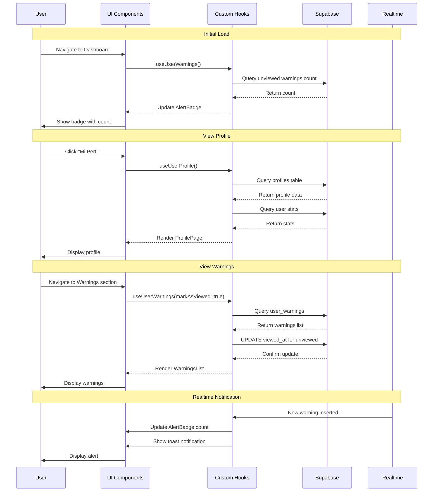

# Design Document

## Overview

Este documento describe el diseño técnico para implementar un sistema completo de perfil de usuario con visualización de amonestaciones, notificaciones en tiempo real, edición de datos personales y estadísticas de uso. El sistema se integra con la arquitectura existente de RESERVEO, utilizando React, TypeScript, Supabase y shadcn/ui.

### Objetivos del Diseño

1. Proporcionar una interfaz centralizada para que los usuarios gestionen su información personal
2. Implementar un sistema de notificaciones visuales para amonestaciones
3. Mostrar historial completo de amonestaciones con contexto de incidentes
4. Permitir edición de datos personales (nombre y teléfono)
5. Mostrar estadísticas de uso del sistema
6. Implementar sistema de "visto" para diferenciar alertas nuevas

### Principios de Diseño

- **Mobile-first**: Diseño responsive que funciona en todos los dispositivos
- **Accesibilidad**: Cumplir con WCAG 2.1 AA
- **Consistencia**: Usar componentes y patrones existentes de shadcn/ui
- **Performance**: Optimizar queries y usar caching apropiado
- **Seguridad**: Respetar RLS y validar todos los inputs

## Architecture

### High-Level Architecture

```
┌─────────────────────────────────────────────────────────────┐
│                     User Interface Layer                     │
├─────────────────────────────────────────────────────────────┤
│  Dashboard Header (Alert Badge) → Profile Page → Warnings   │
│                                                               │
│  Components:                                                  │
│  - AlertBadge (header notification)                          │
│  - ProfilePage (main container)                              │
│  - ProfileEditor (personal data)                             │
│  - WarningsList (warnings display)                           │
│  - WarningCard (individual warning)                          │
│  - UserStats (statistics section)                            │
└─────────────────────────────────────────────────────────────┘
                              ↓
┌─────────────────────────────────────────────────────────────┐
│                    Business Logic Layer                      │
├─────────────────────────────────────────────────────────────┤
│  Custom Hooks:                                               │
│  - useUserProfile() - Profile data and updates              │
│  - useUserWarnings() - Warnings with realtime updates       │
│  - useUserStats() - Usage statistics                        │
│  - useWarningNotifications() - Realtime notifications       │
└─────────────────────────────────────────────────────────────┘
                              ↓
┌─────────────────────────────────────────────────────────────┐
│                      Data Access Layer                       │
├─────────────────────────────────────────────────────────────┤
│  Supabase Client:                                            │
│  - profiles table (SELECT, UPDATE)                           │
│  - user_warnings table (SELECT, UPDATE viewed_at)            │
│  - incident_reports table (SELECT for context)               │
│  - reservations table (SELECT for stats)                     │
│  - license_plates table (SELECT for stats)                   │
│  - Realtime subscriptions (user_warnings)                    │
└─────────────────────────────────────────────────────────────┘
```


### Data Flow



## Components and Interfaces

### 1. AlertBadge Component

**Location**: `src/components/dashboard/AlertBadge.tsx`

**Purpose**: Muestra un indicador visual de amonestaciones no vistas en el header

**Props Interface**:
```typescript
interface AlertBadgeProps {
  count: number;
  onClick: () => void;
}
```

**Key Features**:
- Badge con número de alertas pendientes
- Color rojo para alertas activas
- Oculto cuando count = 0
- Click navega a sección de amonestaciones
- Animación de "pulse" para nuevas alertas

**Dependencies**:
- `@/components/ui/badge`
- `lucide-react` (Bell icon)
- `useUserWarnings` hook


### 2. ProfilePage Component

**Location**: `src/pages/Profile.tsx`

**Purpose**: Página principal del perfil de usuario con tabs para diferentes secciones

**Structure**:
```typescript
interface ProfilePageProps {}

// Tabs structure
type ProfileTab = 'personal' | 'warnings' | 'stats';
```

**Layout**:
- Header con nombre de usuario y Warning_Counter
- Tabs: "Datos Personales", "Amonestaciones", "Estadísticas"
- Responsive: Stack en móvil, side-by-side en desktop
- Breadcrumb: Dashboard > Mi Perfil

**Dependencies**:
- `@/components/ui/tabs`
- `@/components/ui/card`
- `ProfileEditor` component
- `WarningsList` component
- `UserStats` component

### 3. ProfileEditor Component

**Location**: `src/components/profile/ProfileEditor.tsx`

**Purpose**: Formulario para editar datos personales del usuario

**Props Interface**:
```typescript
interface ProfileEditorProps {
  profile: UserProfile;
  onUpdate: (data: ProfileUpdateData) => Promise<void>;
  isLoading: boolean;
}

interface UserProfile {
  id: string;
  email: string;
  full_name: string | null;
  phone: string | null;
  created_at: string;
  updated_at: string;
}

interface ProfileUpdateData {
  full_name: string;
  phone: string;
}
```

**Form Fields**:
- Email (readonly, display only)
- Full Name (text input, required, max 100 chars)
- Phone (text input, optional, format validation)

**Validation Schema** (Zod):
```typescript
const profileSchema = z.object({
  full_name: z.string()
    .min(2, "Mínimo 2 caracteres")
    .max(100, "Máximo 100 caracteres"),
  phone: z.string()
    .regex(/^[+]?[\d\s()-]{9,20}$/, "Formato de teléfono inválido")
    .optional()
    .or(z.literal(''))
});
```

**Key Features**:
- React Hook Form integration
- Inline validation errors
- Loading state during save
- Success/error toast notifications
- Dirty state detection (unsaved changes warning)


### 4. WarningsList Component

**Location**: `src/components/profile/WarningsList.tsx`

**Purpose**: Muestra el historial completo de amonestaciones del usuario

**Props Interface**:
```typescript
interface WarningsListProps {
  warnings: UserWarningWithDetails[];
  isLoading: boolean;
  onWarningClick: (warningId: string) => void;
}

interface UserWarningWithDetails {
  id: string;
  user_id: string;
  incident_id: string;
  issued_by: string;
  issued_at: string;
  reason: string;
  notes: string | null;
  viewed_at: string | null;
  created_at: string;
  // Joined data
  issuer_name: string;
  incident_details: {
    description: string;
    spot_number: string;
    photo_url: string | null;
    created_at: string;
  };
}
```

**Layout**:
- Empty state: "Sin amonestaciones" con ícono positivo
- List of WarningCard components
- Pagination (10 per page)
- Filter: "Todas" | "No vistas" | "Vistas"
- Sort: Más reciente primero

**Key Features**:
- Visual distinction between viewed/unviewed
- Click to expand details
- Link to incident details
- Responsive grid/stack layout

### 5. WarningCard Component

**Location**: `src/components/profile/WarningCard.tsx`

**Purpose**: Muestra una amonestación individual con detalles

**Props Interface**:
```typescript
interface WarningCardProps {
  warning: UserWarningWithDetails;
  onClick: () => void;
  isExpanded: boolean;
}
```

**Visual Design**:
- Card with border (red for unviewed, gray for viewed)
- Header: Date + "Nueva" badge if unviewed
- Body: Reason (bold), Notes (if present)
- Footer: Issued by admin name
- Expandable section: Incident details

**States**:
- Default (collapsed)
- Expanded (shows incident details)
- Unviewed (red accent, bold text)
- Viewed (muted colors)


### 6. UserStats Component

**Location**: `src/components/profile/UserStats.tsx`

**Purpose**: Muestra estadísticas de uso del sistema

**Props Interface**:
```typescript
interface UserStatsProps {
  stats: UserStatistics;
  isLoading: boolean;
}

interface UserStatistics {
  total_reservations: number;
  active_reservations: number;
  last_reservation_date: string | null;
  total_license_plates: number;
  approved_license_plates: number;
  total_warnings: number;
  member_since: string;
}
```

**Layout**:
- Grid of stat cards (2 columns on mobile, 3-4 on desktop)
- Each card: Icon + Number + Label
- Color coding: Green (positive), Yellow (warning), Red (critical)

**Stat Cards**:
1. Total Reservas (calendar icon)
2. Reservas Activas (clock icon)
3. Última Reserva (calendar-check icon)
4. Matrículas Aprobadas (car icon)
5. Total Amonestaciones (alert-triangle icon, color-coded)
6. Miembro Desde (user-check icon)

### 7. WarningCounter Component

**Location**: `src/components/profile/WarningCounter.tsx`

**Purpose**: Muestra el contador total de amonestaciones con código de color

**Props Interface**:
```typescript
interface WarningCounterProps {
  count: number;
  size?: 'sm' | 'md' | 'lg';
}
```

**Visual Design**:
- Large number display
- Color coding:
  - 0: Green background, check icon
  - 1-2: Yellow background, alert icon
  - 3+: Red background, alert-triangle icon
- Label: "Amonestaciones totales"
- Responsive sizing

## Data Models

### Database Schema Changes

**New Column**: `user_warnings.viewed_at`

```sql
-- Migration: Add viewed_at column to user_warnings
ALTER TABLE public.user_warnings
  ADD COLUMN viewed_at TIMESTAMP WITH TIME ZONE;

-- Index for unviewed warnings queries
CREATE INDEX idx_user_warnings_viewed_at
  ON public.user_warnings(user_id, viewed_at)
  WHERE viewed_at IS NULL;

-- Comment
COMMENT ON COLUMN public.user_warnings.viewed_at IS 
  'Timestamp when the user viewed this warning. NULL means unviewed.';
```


### TypeScript Types

**Location**: `src/types/profile.ts`

```typescript
// Profile types
export interface UserProfile {
  id: string;
  email: string;
  full_name: string | null;
  phone: string | null;
  created_at: string;
  updated_at: string;
  is_blocked: boolean;
  is_deactivated: boolean;
}

export interface ProfileUpdateData {
  full_name: string;
  phone: string;
}

// Warning types
export interface UserWarning {
  id: string;
  user_id: string;
  incident_id: string;
  issued_by: string;
  issued_at: string;
  reason: string;
  notes: string | null;
  viewed_at: string | null;
  created_at: string;
}

export interface UserWarningWithDetails extends UserWarning {
  issuer_name: string;
  incident_details: {
    id: string;
    description: string;
    spot_number: string;
    photo_url: string | null;
    created_at: string;
    status: string;
  };
}

// Statistics types
export interface UserStatistics {
  total_reservations: number;
  active_reservations: number;
  last_reservation_date: string | null;
  total_license_plates: number;
  approved_license_plates: number;
  total_warnings: number;
  member_since: string;
}

// Notification types
export interface WarningNotification {
  warning_id: string;
  reason: string;
  issued_at: string;
}
```

### Supabase Queries

**Get User Profile**:
```typescript
const { data, error } = await supabase
  .from('profiles')
  .select('*')
  .eq('id', userId)
  .single();
```

**Update User Profile**:
```typescript
const { data, error } = await supabase
  .from('profiles')
  .update({
    full_name: profileData.full_name,
    phone: profileData.phone,
    updated_at: new Date().toISOString()
  })
  .eq('id', userId)
  .select()
  .single();
```

**Get User Warnings with Details**:
```typescript
const { data, error } = await supabase
  .from('user_warnings')
  .select(`
    *,
    issuer:issued_by(full_name),
    incident:incident_reports(
      id,
      description,
      photo_url,
      created_at,
      status,
      spot:original_spot_id(spot_number)
    )
  `)
  .eq('user_id', userId)
  .order('issued_at', { ascending: false });
```

**Get Unviewed Warnings Count**:
```typescript
const { count, error } = await supabase
  .from('user_warnings')
  .select('*', { count: 'exact', head: true })
  .eq('user_id', userId)
  .is('viewed_at', null);
```

**Mark Warnings as Viewed**:
```typescript
const { error } = await supabase
  .from('user_warnings')
  .update({ viewed_at: new Date().toISOString() })
  .eq('user_id', userId)
  .is('viewed_at', null);
```


**Get User Statistics**:
```typescript
// Total reservations
const { count: totalReservations } = await supabase
  .from('reservations')
  .select('*', { count: 'exact', head: true })
  .eq('user_id', userId);

// Active reservations (future dates)
const { count: activeReservations } = await supabase
  .from('reservations')
  .select('*', { count: 'exact', head: true })
  .eq('user_id', userId)
  .eq('status', 'active')
  .gte('reservation_date', new Date().toISOString().split('T')[0]);

// Last reservation date
const { data: lastReservation } = await supabase
  .from('reservations')
  .select('reservation_date')
  .eq('user_id', userId)
  .order('reservation_date', { ascending: false })
  .limit(1)
  .single();

// License plates
const { count: totalPlates } = await supabase
  .from('license_plates')
  .select('*', { count: 'exact', head: true })
  .eq('user_id', userId)
  .is('deleted_at', null);

const { count: approvedPlates } = await supabase
  .from('license_plates')
  .select('*', { count: 'exact', head: true })
  .eq('user_id', userId)
  .eq('is_approved', true)
  .is('deleted_at', null);

// Total warnings (using existing function)
const { data: warningCount } = await supabase
  .rpc('get_user_warning_count', { _user_id: userId });

// Member since
const { data: profile } = await supabase
  .from('profiles')
  .select('created_at')
  .eq('id', userId)
  .single();
```

## Custom Hooks

### useUserProfile Hook

**Location**: `src/hooks/useUserProfile.ts`

**Purpose**: Gestiona el estado y operaciones del perfil de usuario

```typescript
interface UseUserProfileReturn {
  profile: UserProfile | null;
  isLoading: boolean;
  error: Error | null;
  updateProfile: (data: ProfileUpdateData) => Promise<void>;
  refetch: () => Promise<void>;
}

export const useUserProfile = (): UseUserProfileReturn => {
  const [profile, setProfile] = useState<UserProfile | null>(null);
  const [isLoading, setIsLoading] = useState(true);
  const [error, setError] = useState<Error | null>(null);
  const { user } = useAuth(); // Assuming auth context exists

  const loadProfile = async () => {
    if (!user?.id) return;
    
    setIsLoading(true);
    try {
      const { data, error } = await supabase
        .from('profiles')
        .select('*')
        .eq('id', user.id)
        .single();
      
      if (error) throw error;
      setProfile(data);
    } catch (err) {
      setError(err as Error);
      toast.error('Error al cargar perfil');
    } finally {
      setIsLoading(false);
    }
  };

  const updateProfile = async (data: ProfileUpdateData) => {
    if (!user?.id) return;
    
    try {
      const { error } = await supabase
        .from('profiles')
        .update({
          ...data,
          updated_at: new Date().toISOString()
        })
        .eq('id', user.id);
      
      if (error) throw error;
      
      await loadProfile();
      toast.success('Perfil actualizado correctamente');
    } catch (err) {
      toast.error('Error al actualizar perfil');
      throw err;
    }
  };

  useEffect(() => {
    loadProfile();
  }, [user?.id]);

  return {
    profile,
    isLoading,
    error,
    updateProfile,
    refetch: loadProfile
  };
};
```


### useUserWarnings Hook

**Location**: `src/hooks/useUserWarnings.ts`

**Purpose**: Gestiona amonestaciones con realtime updates y sistema de "visto"

```typescript
interface UseUserWarningsOptions {
  markAsViewed?: boolean;
  filter?: 'all' | 'viewed' | 'unviewed';
}

interface UseUserWarningsReturn {
  warnings: UserWarningWithDetails[];
  unviewedCount: number;
  isLoading: boolean;
  error: Error | null;
  markAllAsViewed: () => Promise<void>;
  refetch: () => Promise<void>;
}

export const useUserWarnings = (
  options: UseUserWarningsOptions = {}
): UseUserWarningsReturn => {
  const { markAsViewed = false, filter = 'all' } = options;
  const [warnings, setWarnings] = useState<UserWarningWithDetails[]>([]);
  const [unviewedCount, setUnviewedCount] = useState(0);
  const [isLoading, setIsLoading] = useState(true);
  const [error, setError] = useState<Error | null>(null);
  const { user } = useAuth();

  const loadWarnings = async () => {
    if (!user?.id) return;
    
    setIsLoading(true);
    try {
      // Build query
      let query = supabase
        .from('user_warnings')
        .select(`
          *,
          issuer:issued_by(full_name),
          incident:incident_reports(
            id,
            description,
            photo_url,
            created_at,
            status,
            spot:original_spot_id(spot_number)
          )
        `)
        .eq('user_id', user.id);

      // Apply filter
      if (filter === 'viewed') {
        query = query.not('viewed_at', 'is', null);
      } else if (filter === 'unviewed') {
        query = query.is('viewed_at', null);
      }

      query = query.order('issued_at', { ascending: false });

      const { data, error: queryError } = await query;
      if (queryError) throw queryError;

      // Transform data
      const transformedData = data.map(w => ({
        ...w,
        issuer_name: w.issuer?.full_name || 'Administrador',
        incident_details: {
          id: w.incident?.id || '',
          description: w.incident?.description || '',
          spot_number: w.incident?.spot?.spot_number || 'N/A',
          photo_url: w.incident?.photo_url || null,
          created_at: w.incident?.created_at || '',
          status: w.incident?.status || ''
        }
      }));

      setWarnings(transformedData);

      // Get unviewed count
      const { count } = await supabase
        .from('user_warnings')
        .select('*', { count: 'exact', head: true })
        .eq('user_id', user.id)
        .is('viewed_at', null);

      setUnviewedCount(count || 0);

      // Mark as viewed if requested
      if (markAsViewed && count && count > 0) {
        await markAllAsViewed();
      }
    } catch (err) {
      setError(err as Error);
      toast.error('Error al cargar amonestaciones');
    } finally {
      setIsLoading(false);
    }
  };

  const markAllAsViewed = async () => {
    if (!user?.id) return;
    
    try {
      const { error } = await supabase
        .from('user_warnings')
        .update({ viewed_at: new Date().toISOString() })
        .eq('user_id', user.id)
        .is('viewed_at', null);

      if (error) throw error;
      
      setUnviewedCount(0);
      await loadWarnings();
    } catch (err) {
      console.error('Error marking warnings as viewed:', err);
    }
  };

  // Setup realtime subscription
  useEffect(() => {
    if (!user?.id) return;

    const channel = supabase
      .channel('user_warnings_changes')
      .on(
        'postgres_changes',
        {
          event: 'INSERT',
          schema: 'public',
          table: 'user_warnings',
          filter: `user_id=eq.${user.id}`
        },
        (payload) => {
          // New warning received
          toast.error('Nueva amonestación recibida', {
            action: {
              label: 'Ver detalles',
              onClick: () => {
                // Navigate to warnings section
                window.location.href = '/profile?tab=warnings';
              }
            }
          });
          
          // Reload warnings
          loadWarnings();
        }
      )
      .subscribe();

    return () => {
      supabase.removeChannel(channel);
    };
  }, [user?.id]);

  useEffect(() => {
    loadWarnings();
  }, [user?.id, filter]);

  return {
    warnings,
    unviewedCount,
    isLoading,
    error,
    markAllAsViewed,
    refetch: loadWarnings
  };
};
```


### useUserStats Hook

**Location**: `src/hooks/useUserStats.ts`

**Purpose**: Obtiene estadísticas de uso del usuario

```typescript
interface UseUserStatsReturn {
  stats: UserStatistics | null;
  isLoading: boolean;
  error: Error | null;
  refetch: () => Promise<void>;
}

export const useUserStats = (): UseUserStatsReturn => {
  const [stats, setStats] = useState<UserStatistics | null>(null);
  const [isLoading, setIsLoading] = useState(true);
  const [error, setError] = useState<Error | null>(null);
  const { user } = useAuth();

  const loadStats = async () => {
    if (!user?.id) return;
    
    setIsLoading(true);
    try {
      // Execute all queries in parallel
      const [
        totalReservationsResult,
        activeReservationsResult,
        lastReservationResult,
        totalPlatesResult,
        approvedPlatesResult,
        warningCountResult,
        profileResult
      ] = await Promise.all([
        supabase
          .from('reservations')
          .select('*', { count: 'exact', head: true })
          .eq('user_id', user.id),
        
        supabase
          .from('reservations')
          .select('*', { count: 'exact', head: true })
          .eq('user_id', user.id)
          .eq('status', 'active')
          .gte('reservation_date', new Date().toISOString().split('T')[0]),
        
        supabase
          .from('reservations')
          .select('reservation_date')
          .eq('user_id', user.id)
          .order('reservation_date', { ascending: false })
          .limit(1)
          .maybeSingle(),
        
        supabase
          .from('license_plates')
          .select('*', { count: 'exact', head: true })
          .eq('user_id', user.id)
          .is('deleted_at', null),
        
        supabase
          .from('license_plates')
          .select('*', { count: 'exact', head: true })
          .eq('user_id', user.id)
          .eq('is_approved', true)
          .is('deleted_at', null),
        
        supabase.rpc('get_user_warning_count', { _user_id: user.id }),
        
        supabase
          .from('profiles')
          .select('created_at')
          .eq('id', user.id)
          .single()
      ]);

      // Check for errors
      if (totalReservationsResult.error) throw totalReservationsResult.error;
      if (activeReservationsResult.error) throw activeReservationsResult.error;
      if (totalPlatesResult.error) throw totalPlatesResult.error;
      if (approvedPlatesResult.error) throw approvedPlatesResult.error;
      if (warningCountResult.error) throw warningCountResult.error;
      if (profileResult.error) throw profileResult.error;

      setStats({
        total_reservations: totalReservationsResult.count || 0,
        active_reservations: activeReservationsResult.count || 0,
        last_reservation_date: lastReservationResult.data?.reservation_date || null,
        total_license_plates: totalPlatesResult.count || 0,
        approved_license_plates: approvedPlatesResult.count || 0,
        total_warnings: warningCountResult.data || 0,
        member_since: profileResult.data.created_at
      });
    } catch (err) {
      setError(err as Error);
      toast.error('Error al cargar estadísticas');
    } finally {
      setIsLoading(false);
    }
  };

  useEffect(() => {
    loadStats();
  }, [user?.id]);

  return {
    stats,
    isLoading,
    error,
    refetch: loadStats
  };
};
```

## Error Handling

### Validation Errors

**Profile Update**:
- Full name: Min 2 chars, max 100 chars
- Phone: Optional, regex validation for international formats
- Display inline errors below fields
- Prevent submission if validation fails

**Database Errors**:
- 23505 (Unique constraint): "Este valor ya existe"
- 42501 (RLS): "No tienes permisos para esta acción"
- Network errors: "Error de conexión. Intenta de nuevo"
- Generic: "Error inesperado. Contacta soporte"

### Loading States

**Skeleton Loaders**:
- ProfileEditor: Skeleton for form fields
- WarningsList: Skeleton cards (3-5 items)
- UserStats: Skeleton stat cards
- AlertBadge: Show spinner while loading count

**Empty States**:
- No warnings: Positive message with green check icon
- No stats: "Aún no has usado el sistema"
- No profile data: Redirect to setup


## Testing Strategy

### Unit Tests

**Components to Test**:
1. `ProfileEditor` - Form validation, submission
2. `WarningCard` - Display logic, expand/collapse
3. `WarningCounter` - Color coding logic
4. `AlertBadge` - Count display, visibility

**Test Cases**:
```typescript
// ProfileEditor.test.tsx
describe('ProfileEditor', () => {
  it('validates full_name minimum length', () => {});
  it('validates phone format', () => {});
  it('shows success toast on update', () => {});
  it('disables email field', () => {});
  it('shows loading state during save', () => {});
});

// WarningCard.test.tsx
describe('WarningCard', () => {
  it('shows "Nueva" badge for unviewed warnings', () => {});
  it('uses red border for unviewed warnings', () => {});
  it('expands to show incident details', () => {});
  it('formats date correctly', () => {});
});

// WarningCounter.test.tsx
describe('WarningCounter', () => {
  it('shows green for 0 warnings', () => {});
  it('shows yellow for 1-2 warnings', () => {});
  it('shows red for 3+ warnings', () => {});
});
```

### Integration Tests

**User Flows**:
1. Navigate to profile → Edit name → Save → Verify update
2. View warnings list → Mark as viewed → Verify count updates
3. Receive new warning → See notification → Navigate to warnings
4. View incident details from warning → Verify data displayed

### E2E Tests (Optional)

**Critical Paths**:
1. Complete profile setup flow
2. Warning notification and viewing flow
3. Profile update with validation errors

## Routing

### New Routes

**Add to React Router**:

```typescript
// src/main.tsx or router config
{
  path: '/profile',
  element: <ProfilePage />,
  children: [
    {
      index: true,
      element: <Navigate to="/profile?tab=personal" replace />
    }
  ]
}
```

**Query Parameters**:
- `/profile?tab=personal` - Datos personales
- `/profile?tab=warnings` - Amonestaciones
- `/profile?tab=stats` - Estadísticas

### Navigation Updates

**Dashboard Header**:
```typescript
// Add to header navigation
<DropdownMenu>
  <DropdownMenuTrigger>
    <Avatar>
      <AvatarFallback>{userInitials}</AvatarFallback>
    </Avatar>
    {unviewedCount > 0 && (
      <Badge variant="destructive" className="absolute -top-1 -right-1">
        {unviewedCount}
      </Badge>
    )}
  </DropdownMenuTrigger>
  <DropdownMenuContent>
    <DropdownMenuItem onClick={() => navigate('/profile')}>
      <User className="mr-2 h-4 w-4" />
      Mi Perfil
    </DropdownMenuItem>
    <DropdownMenuItem onClick={() => navigate('/profile?tab=warnings')}>
      <Bell className="mr-2 h-4 w-4" />
      Amonestaciones
      {unviewedCount > 0 && (
        <Badge variant="destructive" className="ml-2">
          {unviewedCount}
        </Badge>
      )}
    </DropdownMenuItem>
    <DropdownMenuSeparator />
    <DropdownMenuItem onClick={handleLogout}>
      <LogOut className="mr-2 h-4 w-4" />
      Cerrar Sesión
    </DropdownMenuItem>
  </DropdownMenuContent>
</DropdownMenu>
```

## Performance Considerations

### Optimization Strategies

1. **Query Optimization**:
   - Use `select` with specific columns instead of `*`
   - Add indexes on `user_warnings(user_id, viewed_at)`
   - Use `count: 'exact'` only when necessary

2. **Caching**:
   - Cache profile data in hook with `useRef`
   - Invalidate cache on updates
   - Use React Query for automatic caching (optional enhancement)

3. **Realtime Subscriptions**:
   - Single channel per user
   - Cleanup on unmount
   - Debounce rapid updates

4. **Pagination**:
   - Load 10 warnings per page
   - Implement "Load More" button
   - Virtual scrolling for 50+ warnings (future enhancement)

5. **Image Loading**:
   - Lazy load incident photos
   - Use thumbnails for list view
   - Full size on modal/detail view


## Security Considerations

### Row Level Security (RLS)

**Existing Policies** (verified):
- ✅ Users can view their own warnings
- ✅ Admins can view all warnings
- ✅ Admins can create warnings

**New Policy Needed**:
```sql
-- Allow users to update viewed_at on their own warnings
CREATE POLICY "Users can mark their warnings as viewed"
  ON public.user_warnings FOR UPDATE
  TO authenticated
  USING (auth.uid() = user_id)
  WITH CHECK (
    auth.uid() = user_id AND
    -- Only allow updating viewed_at column
    (NEW.viewed_at IS DISTINCT FROM OLD.viewed_at) AND
    -- Prevent changing other columns
    NEW.id = OLD.id AND
    NEW.user_id = OLD.user_id AND
    NEW.incident_id = OLD.incident_id AND
    NEW.issued_by = OLD.issued_by AND
    NEW.issued_at = OLD.issued_at AND
    NEW.reason = OLD.reason AND
    (NEW.notes IS NOT DISTINCT FROM OLD.notes) AND
    NEW.created_at = OLD.created_at
  );
```

### Input Validation

**Frontend Validation** (Zod):
- Full name: String, 2-100 chars, no special chars
- Phone: Optional, regex for international format
- Sanitize inputs before display

**Backend Validation** (RLS):
- Users can only update their own profile
- Email cannot be changed (readonly)
- Prevent SQL injection via parameterized queries

### Data Privacy

**Sensitive Data**:
- Phone numbers: Only visible to user and admins
- Warning details: Only visible to affected user and admins
- Incident photos: Access controlled via storage RLS

**Audit Trail**:
- Profile updates: Track in `updated_at` column
- Warning views: Track in `viewed_at` column
- Consider adding audit log table for profile changes (future)

## Accessibility (A11y)

### WCAG 2.1 AA Compliance

**Keyboard Navigation**:
- All interactive elements focusable
- Tab order logical (top to bottom, left to right)
- Escape key closes modals/dropdowns
- Enter/Space activates buttons

**Screen Reader Support**:
- Semantic HTML (`<nav>`, `<main>`, `<section>`)
- ARIA labels on icons and buttons
- ARIA live regions for notifications
- Form labels properly associated

**Visual Accessibility**:
- Color contrast ratio ≥ 4.5:1 for text
- Color not sole indicator (use icons + text)
- Focus indicators visible (ring-2)
- Text resizable up to 200%

**Implementation Examples**:
```typescript
// AlertBadge
<button
  aria-label={`${count} amonestaciones sin leer`}
  aria-live="polite"
  onClick={onClick}
>
  <Bell className="h-5 w-5" aria-hidden="true" />
  <Badge>{count}</Badge>
</button>

// WarningCard
<article
  role="article"
  aria-label={`Amonestación del ${formatDate(warning.issued_at)}`}
>
  <h3>{warning.reason}</h3>
  <p>{warning.notes}</p>
</article>

// ProfileEditor
<form aria-label="Editar perfil personal">
  <label htmlFor="full_name">Nombre completo</label>
  <input
    id="full_name"
    aria-required="true"
    aria-invalid={!!errors.full_name}
    aria-describedby={errors.full_name ? "full_name_error" : undefined}
  />
  {errors.full_name && (
    <span id="full_name_error" role="alert">
      {errors.full_name.message}
    </span>
  )}
</form>
```

## Responsive Design

### Breakpoints

- **Mobile**: 320px - 767px (stack layout)
- **Tablet**: 768px - 1023px (2-column grid)
- **Desktop**: 1024px+ (3-column grid, side-by-side)

### Layout Adaptations

**ProfilePage**:
- Mobile: Tabs stacked, full width
- Tablet: Tabs horizontal, content full width
- Desktop: Sidebar navigation, content area

**WarningsList**:
- Mobile: Single column, cards stacked
- Tablet: 2 columns
- Desktop: 2-3 columns with filters sidebar

**UserStats**:
- Mobile: 2 columns (2x3 grid)
- Tablet: 3 columns (2x2 grid)
- Desktop: 4 columns (single row)

### Touch Targets

- Minimum 44x44px for all interactive elements
- Adequate spacing between clickable items (8px+)
- Larger tap areas on mobile

## Migration Plan

### Database Migration

**File**: `supabase/migrations/YYYYMMDDHHMMSS_add_warning_viewed_tracking.sql`

```sql
-- Add viewed_at column to user_warnings
ALTER TABLE public.user_warnings
  ADD COLUMN viewed_at TIMESTAMP WITH TIME ZONE;

-- Create index for performance
CREATE INDEX idx_user_warnings_viewed_at
  ON public.user_warnings(user_id, viewed_at)
  WHERE viewed_at IS NULL;

-- Add RLS policy for updating viewed_at
CREATE POLICY "Users can mark their warnings as viewed"
  ON public.user_warnings FOR UPDATE
  TO authenticated
  USING (auth.uid() = user_id)
  WITH CHECK (
    auth.uid() = user_id AND
    (NEW.viewed_at IS DISTINCT FROM OLD.viewed_at) AND
    NEW.id = OLD.id AND
    NEW.user_id = OLD.user_id AND
    NEW.incident_id = OLD.incident_id AND
    NEW.issued_by = OLD.issued_by AND
    NEW.issued_at = OLD.issued_at AND
    NEW.reason = OLD.reason AND
    (NEW.notes IS NOT DISTINCT FROM OLD.notes) AND
    NEW.created_at = OLD.created_at
  );

-- Add comment
COMMENT ON COLUMN public.user_warnings.viewed_at IS 
  'Timestamp when the user viewed this warning. NULL means unviewed.';
```

### Deployment Steps

1. **Database**:
   - Create and test migration locally
   - Apply to production: `supabase db push`
   - Regenerate types: `supabase gen types typescript --linked`

2. **Frontend**:
   - Create types file
   - Implement hooks
   - Build components
   - Add routing
   - Update navigation

3. **Testing**:
   - Unit tests for components
   - Integration tests for flows
   - Manual testing on mobile/tablet/desktop
   - Accessibility audit

4. **Rollout**:
   - Deploy to staging
   - User acceptance testing
   - Deploy to production
   - Monitor for errors

## Future Enhancements

### Phase 2 Features

1. **Email Notifications**:
   - Send email when warning issued
   - Daily digest of unviewed warnings
   - Configurable notification preferences

2. **Warning Appeals**:
   - Allow users to contest warnings
   - Admin review workflow
   - Appeal history tracking

3. **Gamification**:
   - "Clean record" badges
   - Streak tracking (days without warnings)
   - Positive reinforcement for good behavior

4. **Advanced Statistics**:
   - Charts and graphs
   - Comparison with other users (anonymized)
   - Trends over time

5. **Profile Customization**:
   - Avatar upload
   - Theme preferences
   - Language selection

6. **Export Data**:
   - Download warning history as PDF
   - Export statistics as CSV
   - GDPR compliance (data portability)

## References

- [Supabase Realtime Documentation](https://supabase.com/docs/guides/realtime)
- [React Hook Form](https://react-hook-form.com/)
- [Zod Validation](https://zod.dev/)
- [shadcn/ui Components](https://ui.shadcn.com/)
- [WCAG 2.1 Guidelines](https://www.w3.org/WAI/WCAG21/quickref/)
